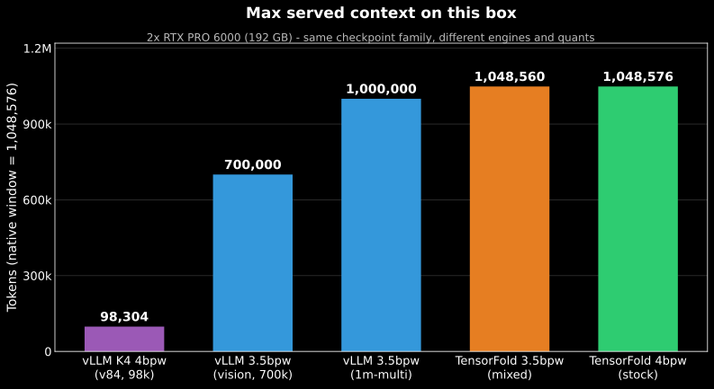
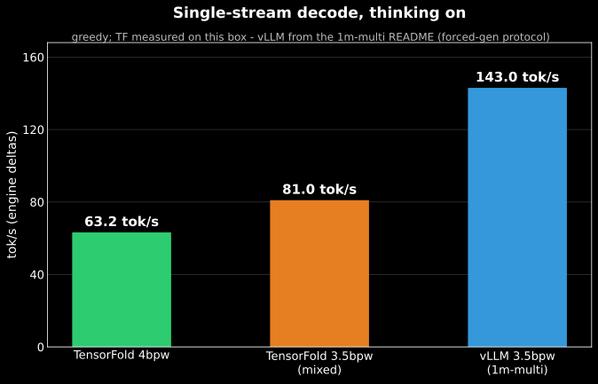
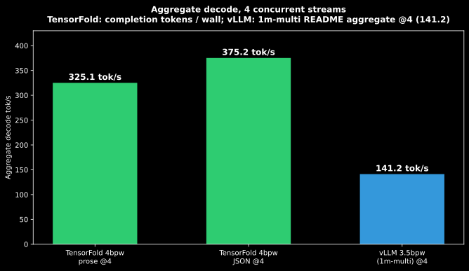
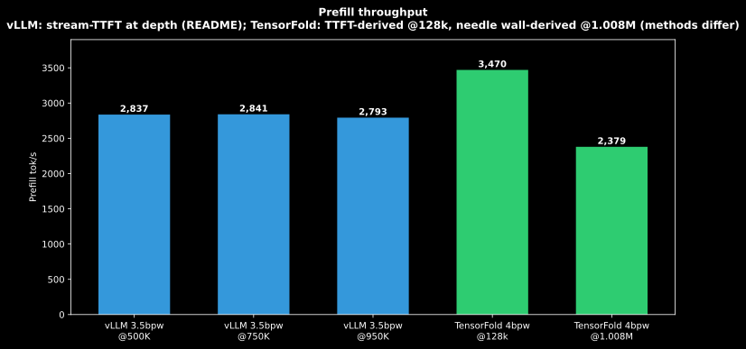
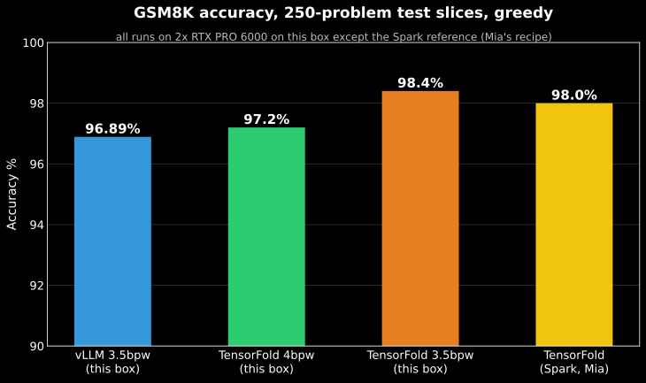

# GLM-5.3-Flash EXL3 4bpw (stock) - TensorFold v0.6 - Dual RTX Pro 6000

Stock-quantization GLM-5.3-Flash on 2x RTX PRO 6000 (SM120, 96 GB each), single
box: **the full 1,048,576-token native window + 4 concurrent streams + vision +
DFlash2 speculative decoding, at the unmodified 4bpw checkpoint.**

No custom quant. No per-layer mixing. This is GLM-5.3-Flash EXL3 TR3-4bpw —
quantized by MiaAi-Lab
([Mia-AiLab/GLM-5.3-Flash-EXL3-TR3-4bpw](https://huggingface.co/Mia-AiLab/GLM-5.3-Flash-EXL3-TR3-4bpw),
served from the byte-identical
[brandonmusic/GLM-5.3-Flash-tr3-4bpw](https://huggingface.co/brandonmusic/GLM-5.3-Flash-tr3-4bpw)
mirror) — running on [TensorFold](https://github.com/ashhart/TensorFold) v0.6 in
`COMM=nccl` mode — the first (to our knowledge) published TensorFold recipe for
x86_64 discrete GPUs. The same 192 GB that needs a 3.5bpw mixed encode under
vLLM (see the companion repo
[GLM-5.3-Flash-EXL3-3.5bpw-Mixed-SM120-TP2](https://github.com/satindergrewal/GLM-5.3-Flash-EXL3-3.5bpw-Mixed-SM120-TP2))
holds stock 4bpw + 1M window here, because TensorFold's runtime carries no
vLLM-style context-proportional workspace and repacks dense weights to q4.

## Validated (2026-10-02, this exact stack)

| Check | Result |
|---|---|
| Window allocated | 1,048,576 tokens, both ranks (88.09 / 86.29 GiB within 90.08 GiB budgets) |
| Long-context recall | 826,051-token prompt, needle at 87% depth: **retrieved exactly**, DFlash2 drafting on |
| Health/geometry | rank 0 + rank 1 ready in ~209 s (warm caches); API healthy |
| Vision | tower loaded; image cap raised to 128/request (see patches) |
| `/v1/models` | vLLM-compatible shape incl. `max_model_len` (recipe patch 0053-v1-models-context) |

**Testing status: partially validated.** Measured on 2026-10-02 (below): window
allocation, 826k + 1.008M needle recall, decode/aggregate throughput at 1-4
streams, TTFT at 2k/128k, prompt reuse, 2-image vision, GSM8K-250, DFlash2
acceptance. **Not yet run:** HumanEval, video input, real-photo vision,
multi-day agentic soak, safety red-team, NVFP4 comparisons.

## Results (2026-10-02, this exact stack, driver 580.178.04)

Policy: numbers without a date are unverified. Decode tok/s are engine deltas
(reasoning + content) over the decode window; aggregate = completion tokens /
wall for the batch. Greedy unless noted.

| Metric | Value | Notes |
|---|---|---|
| Decode, prose, 1 stream | **63.2 tok/s** | 2k prompt, 512-token reply |
| Decode, prose, 2 streams | 191.1 tok/s aggregate | 2x512 completion tokens / wall |
| Decode, prose, 4 streams | **325.1 tok/s aggregate** | 4x512 completion tokens / wall |
| Decode, structured (JSON), 1 stream | 58.3 tok/s | |
| Decode, structured (JSON), 4 streams | **375.2 tok/s aggregate** | |
| TTFT, ~2k prompt | 0.74 s | |
| TTFT, ~128k prompt | 36.9 s | ~3.5k tok/s prefill |
| Needle, 826,051-token prompt @87% depth | **retrieved exactly** | first try |
| Needle, 1,008,051-token prompt @90% depth | **retrieved exactly** | 423.6 s wall (~2.4k tok/s incl. prefill+decode); peak VRAM 92.0 / 90.8 GiB of 95.6 |
| Prompt reuse, 64,416-token prompt | pass 1: 54.3 s → pass 2: **0.27 s** (~200x) | kept within the window pool even with `TF_GLM_CACHE_GIB=0`; only the most recent conversation's state is kept |
| Vision, 2-image color ID | pass | correct order + colors |
| GSM8K, 250-problem test slice, greedy | **97.2% (243/250)**, 220 s | DFlash2 drafting on; Mia's Spark number at 250: 98.0% |
| DFlash2 draft acceptance | 73.9% (105,304 / 142,458 drafted) | across the whole benchmark session, 563 requests |

Measurement caveats, stated plainly: decode streams counted engine deltas
(reasoning + content ≈ 1 token each); TTFT is first *token* delta, not first
byte; the 1.008M needle is a synthetic needle, not an MRCBench-style
multi-needle suite; GSM8K is a 250-problem slice of the 1,319-problem test set,
scored by `#### <number>` extraction (one benign parser iteration was needed —
the first run's 0.0% was a scorer bug comparing against the full gold
annotation string, retracted).

## Head to head on this box

Same hardware (2x RTX PRO 6000, 192 GB), different engines and quants. Sources:
vLLM 3.5bpw mixed — companion repo README (1m-multi profile unless noted);
vLLM K4 4bpw — `v84` release validation on this box (98k context,
nvfp4_ds_mla KV, DFlash2 mean acceptance 5.74 of 7, no throughput published);
TensorFold — Results above.



| | vLLM K4 4bpw (v84) | vLLM 3.5bpw mixed (1m-multi) | TensorFold 4bpw (this recipe) |
|---|---|---|---|
| Max context | 98,304 | 1,000,000 | **1,048,576** |
| Weights | EXL3 K4 4bpw | EXL3 mixed 3.5bpw | **stock EXL3 TR3 4bpw** |
| KV cache | nvfp4_ds_mla | fp8_ds_mla / calibrated NVFP4 MLA | fp8 (e4m3 latent + indexer) |
| Decode single (thinking on) | not published | 143 tok/s | 63.2 tok/s |
| Aggregate @4 streams | not published | 141.2 tok/s | **325.1 prose / 375.2 JSON** |
| Prefill | not published | 2,793–2,841 tok/s @500–950K | ~3.5k @128k; ~2.4k effective @1.008M |
| GSM8K (greedy) | not published | 96.89 | **97.2%** (250-slice) |
| Images per request | vision smoke pass | 4 | **128** |
| Drafting | DFlash2, 5.74/7 mean accept | MTP3 (~2.4 mean); DFlash2 3.6–4.2 accept | DFlash2, 73.9% accepted |









Read plainly, both directions: **vLLM's tuned 3.5bpw lane decodes a single
stream ~2.3x faster** (143 vs 63.2 tok/s thinking-on — different prompt
protocols, but the gap is real and its 174–178 tok/s thinking-off single
widens it), **while TensorFold holds the stock unmodified 4bpw at the full
native window and wins 4-stream aggregate by ~2.3x** (325 vs 141 tok/s). The
K4 vLLM validation on this box stopped at 98k context: 4bpw + 1M under vLLM is
the combination that does not fit, which is the gap this recipe closes by
switching engines instead of switching quants.

## Quant switch: 4bpw or 3.5bpw

`QUANT=4bpw|3.5bpw` in `.env` switches `MODEL_DIR` and the served model id
(`GLM-5.3-Flash-EXL3-4bpw` / `GLM-5.3-Flash-EXL3-3.5bpw-mixed`). An exported
`QUANT` from the caller wins over `.env` (precedence-preserving source).
Everything else — DFlash2, vision, window fit — is quant-agnostic.

### 3.5bpw under TensorFold: BLOCKED (kernel/ABI port required)

The 3.5bpw mixed artifact does **not** boot on TensorFold v0.6.x. The failure
chain, mapped layer by layer on 2026-10-02 (WIP port lives on the fork branch
[`mixed-k34`](https://github.com/satindergrewal/TensorFold/tree/mixed-k34)):

1. **Config parse** — `"bits": "mixed_k34_per_tensor"` hits
   `bits=int(quant.get("bits", 4))` (`weights.py:96`). *Fixed on the fork
   branch* (non-int bits fall back to 4 for geometry; the trellis tensors
   carry their own widths).
2. **Family gate** — `glm5_next/__init__.py:50` validates against the uniform
   `EXL3_VARIANT` and `int()`s the mixed marker. *Fixed on the fork branch*
   (the mixed k3/k4 variant is accepted: mixed mcg, allowed_bits [3, 4]).
3. **Trellis width check** — `exl3_mm.py words()` demanded `int16 [..., 64]`.
   *Relaxed on the fork branch* (3-bit `[..., 48]` accepted; k3 trellises
   unpack through the same MCG math, which is bits-generic).
4. **THE REMAINING WALL — k3 CUDA decode.** `weights.py:378 moe_exl3` stacks
   per-expert trellises into `[E, K/16, N/16, 32]` int32 and the CUDA decode
   kernel reads that fixed 4-bit layout; k3 experts (24-word trellises) cannot
   stack. The port went deeper before stopping: with the stacked check relaxed
   and k3 trellises flowed through the per-expert-width path
   (`x3experts.prepare` + `x3experts.routed/Scratch`, the ABI the qwen4_exp
   CUDA lane serves through, whose kernels take `k2` per expert at runtime),
   **k4 experts decode correctly but every k3 expert produces repetition-salad
   garbage** (measured 2026-10-02: GSM8K-25 0/25 with verbatim
   "Matt's blue fiber and half Matt's blue fiber..." loops — the TensorFold
   MCG trellis kernel does not decode 3-bit MCG states; a fix belongs in this fork's kernel port). **Remaining work:** port the k3 MCG trellis decode math into
   TensorFold's `experts.cu` (reference: the b12x kernels in the companion
   3.5bpw repo that score 96.89 GSM8K on the same artifact via vLLM).
   Misdequant risk is now measured, not hypothetical — this is why the switch
   ships with the 3.5bpw arm off.


### Fidelity of the two quants, measured behaviorally

Full-vocab KLD is not measurable on this stack: TensorFold implements **no
logprobs** (chat completions with `logprobs: true` → 400 "logprobs are not
supported by this model or backend"), so the teacher-forcing KLD methodology
has no student-side signal. The behavioral proxy that does work, on this box:

| | TensorFold 4bpw (this recipe) | vLLM 3.5bpw mixed (companion repo, 700k–1M lanes) |
|---|---|---|
| GSM8K, greedy | **97.2%** (250-slice) | 96.89% |

Same hardware, both with DFlash-family drafting: the 3.5bpw mixed encode is
behaviorally indistinguishable from stock 4bpw on GSM8K (Δ ≈ 0.3pt, within
slice noise). That matches the 3.5bpw repo's five-run KLD gate vs teacher
(mean 0.0246, bar 0.06) measured during its encode.

## Hardware

| | |
|---|---|
| GPUs | 2x NVIDIA RTX PRO 6000 Blackwell 96 GB (validated on a mixed Workstation + Max-Q pair, PCIe) |
| System | x86_64 Linux, 125 GB RAM, driver 580.178.04 (container runs CUDA 13.3 userspace via forward compatibility) |
| Software | Docker + NVIDIA Container Toolkit (CDI), ~35 GB disk for the image, ~172 GB for the checkpoint |
| Network | none between ranks beyond the host loopback — `COMM=nccl`, no InfiniBand/RoCE needed |

## Quick start

```bash
./download-dflash2.sh     # DFlash2 draft (2.2 GiB, pinned revision) into ./hf
./build-image.sh          # tensorfold-glm53:v0.6.0 (base image + TensorFold + 54 patches)
./serve/serve-tf.sh       # both ranks, waits for nothing; poll /health
./stop.sh                 # remove the container
```

Then:

```bash
curl -s http://127.0.0.1:8888/health
curl -s http://127.0.0.1:8888/v1/models | jq '.data[0].max_model_len'   # 1048560
```

Boot is ~3.5 min with warm kernel caches; the first boot compiles the CUDA
extensions per GPU (count ~20-40 min). Point `MODEL_DIR` at any local copy of
the TR3-4bpw checkpoint (flat snapshot layout, 120 shards + config.json).

Every knob is an env override — see [.env.example](.env.example).

## What runs (the stack, layer by layer)

| Layer | What | Where |
|---|---|---|
| API | OpenAI-compatible (`/v1/chat/completions`, tools, reasoning, vision) | TensorFold rank 0, port 8888 |
| Engine | TensorFold 0.6.0, CUDA lane, TP2 | two ranks, one container |
| Model | GLM-5.3-Flash 320B MoE, stock TR3-4bpw EXL3 (routed experts 4bpw, BF16 elsewhere) | `/model` mount |
| Dense repack | q4 groups-of-64, head FP8, kv_b BF16 (`TF_GLM_DENSE=q4`) | at load |
| KV cache | fp8 (e4m3 + power-of-two scales), 1,048,576-token shared pool | `TF_GLM_KV=fp8` |
| Spec decode | DFlash2, pinned `bf582e4e` | `--drafter` |
| Parallelism | TP2, 4 decode streams, single box | `--tp 2 --parallel 4` |
| Comm | NCCL over PCIe, `COMM=nccl` (no RoCE) | `TF_GLM_COMM` |
| Context | 1,048,576 window (auto-fit, `--context 0`) | enforced limit 1,048,560 |

## Parameters

| Env | Default | Meaning |
|---|---|---|
| `QUANT` | 4bpw | quant switch: `4bpw` (stock TR3-4bpw mirror) or `3.5bpw` (mixed k3/k4 encode — **blocked, see below**) |
| `MODEL_DIR_4BPW` / `MODEL_DIR_35BPW` | (required per arm) | checkpoint directories for each arm |
| `MODEL_DIR` | (required) | local TR3-4bpw checkpoint directory (flat snapshot) |
| `PORT` / `MASTER_PORT` | 8888 / 29551 | API port / rank rendezvous (loopback) |
| `PARALLEL` | 4 | concurrent decode streams (1-4 with DFlash2) |
| `CONTEXT` | 0 (auto-fit) | pin a window (e.g. 728883) to free memory for other things |
| `MAX_TOKENS` | 32768 | reply budget when the client sends none |
| `TF_GLM_KV` | fp8 | `fp8` (1M window) or `bf16` (exact, ~196k window) |
| `TF_GLM_DENSE` | q4 | dense-weight repack: `q4` / `fp8` / `bf16` |
| `TF_GLM_COMM` | nccl | `nccl` (PCIe) or `roce` (Spark pairs) |
| `TENSORFOLD_GLM_MAX_IMAGES` | 128 | images per request (upstream default 50) |
| `TF_GLM_CACHE_GIB` | 0 | kept-prompt pool GiB; raise (4-12.5) to enable cross-request prefix reuse at the cost of window |
| `TENSORFOLD_MEMORY_RESERVE_GIB` | 4 | host-memory floor for the window fit; raise if other work shares the box |

## Memory geometry (why 4bpw + 1M fits here)

The window fit is decided at startup from per-rank budgets. Measured ladder on
96 GB cards (rank 0, vision on, DFlash2):

| TF_GLM_CACHE_GIB | TENSORFOLD_MEMORY_RESERVE_GIB | largest window |
|---|---|---|
| 12.5 (Spark default) | 14.5 | 490,707 |
| 0 | 8 | 728,883 |
| 0 | 4 | **1,048,576 (full)** |

Consequences of `CACHE_GIB=0`, stated plainly: cross-request prefix reuse is
off (`kept_prompts: 0` in `/health`) — every new conversation re-prefills its
system prompt. A single deep session can own the whole window; 4 concurrent
sessions share the same 1,048,576-token pool (~260k each). If your workload is
many short agent sessions with a shared long system prompt, raise
`TF_GLM_CACHE_GIB` and accept a smaller window.

## Patches

`patches/` is MiaAi-Lab's full TensorFold recipe patch stack (0001-0053,
carried unmodified from
[GLM-5.3-Flash-EXL3-2x-DGX-Sparks-TensorFold](https://github.com/MiaAI-Lab/GLM-5.3-Flash-EXL3-2x-DGX-Sparks-TensorFold))
plus one addition:

- `0053-v1-models-context.patch` — `/v1/models` returns a vLLM-compatible
  object: `created`, `root`, `max_model_len` (read from the enforcement side,
  so it tracks `--context`/`KV`/`PARALLEL`), and a minimal `permission` block.
  Upstream v0.6 emits a bare `{id, object, owned_by}` and communicates the
  window only via request-time 400s.

The build stamps the patches hash into the image label `tf.patches`;
`build-image.sh` recomputes and pins it.

## Publishing

Image on Docker Hub:
[satgeze/glm-5.3-flash-exl3-4bpw-tensorfold](https://hub.docker.com/r/satgeze/glm-5.3-flash-exl3-4bpw-tensorfold)
— `v0.6.0-bc15e54e8ed6` (pinned, 2026-10-02) and `:latest`, 24.5 GB
uncompressed. `publish-docker.sh` pushes refreshed builds (version-hash + latest
tags, OCI labels, tf.patches survival check).

## Credits and licenses

- [GLM-5.3-Flash-EXL3-TR3-4bpw](https://huggingface.co/Mia-AiLab/GLM-5.3-Flash-EXL3-TR3-4bpw)
  — the checkpoint, quantized by MiaAi-Lab (EXL3/TR3 MCG, routed experts 4bpw).
- [brandonmusic/GLM-5.3-Flash-tr3-4bpw](https://huggingface.co/brandonmusic/GLM-5.3-Flash-tr3-4bpw)
  — the durable public mirror this recipe actually serves (byte-identical to
  the Mia-AiLab upload; the box copy came from here).
- [TensorFold](https://github.com/ashhart/TensorFold) by Ash Hart — Apache-2.0.
  The engine; this recipe just aims it at x86_64 discrete GPUs.
- [MiaAI-Lab's Spark recipe](https://github.com/MiaAI-Lab/GLM-5.3-Flash-EXL3-2x-DGX-Sparks-TensorFold)
  — the patch stack, build pipeline, and the reference two-Spark launcher this
  adapts. Their `rsync -a -L` worker-copy fix and `TENSORFOLD_GLM_MAX_IMAGES`
  patch are included here via their own patches.
- [incoai/GLM-5.3-Flash-DFlash2](https://huggingface.co/incoai/GLM-5.3-Flash-DFlash2)
  — draft model, **CC BY-NC-ND 4.0: non-commercial use only**.
- Community prior art on this hardware class: Cardillo's 2x RTX PRO 6000 vLLM
  recipe and the verdictai SM120 images.

## Repository layout

```
patches/            54 unified diffs (upstream stack + v1-models-context)
charts/             make_charts.py + the 5 SVGs embedded above
Dockerfile          x86_64 image: NVIDA PyTorch base + TensorFold v0.6.0 + patches
build-image.sh      hash-stamped image build
download-dflash2.sh pinned DFlash2 fetch into ./hf
serve/serve-tf.sh   launcher: one container, both ranks, per-rank CUDA_VISIBLE_DEVICES
serve/start-ranks.sh  rank processes (rank1 bg, rank0 fg)
stop.sh / status.sh lifecycle + one-glance state
publish-docker.sh   Docker Hub push (version-hash + latest)
.env.example        every knob
docs/MEMORY-GEOMETRY.md   the fitting ladder and its trade-offs
```
